# ATI: Any Trajectory Instruction for Controllable Video Generation

<div align="center">
  
[](https://arxiv.org/pdf/2505.22944)&nbsp;
[](https://anytraj.github.io/)&nbsp;
<a href="https://huggingface.co/bytedance-research/ATI/"></a>
</div>


> [**ATI: Any Trajectory Instruction for Controllable Video Generation**](https://anytraj.github.io/)<br>
> [Angtian Wang](https://angtianwang.github.io/), [Haibin Huang](https://brotherhuang.github.io/), Jacob Zhiyuan Fang, [Yiding Yang](https://ihollywhy.github.io/), [Chongyang Ma](http://www.chongyangma.com/), 
> <br>Intelligent Creation Team, ByteDance<br>

[](https://youtu.be/76jjPT0f8Hs)

This is the repo for Wan2.1 ATI (Any Trajectory Instruction for Controllable Video Generation), a trajectory-based motion control framework that unifies object, local and camera movements in video generation. This repo is based on [Wan2.1 offical implementation](https://github.com/Wan-Video/Wan2.1).

## Install

ATI requires a same environment as offical Wan 2.1. Follow the instruction of INSTALL.md (Wan2.1).

```
git clone https://github.com/bytedance/ATI.git
cd ATI
```

Install packages

```
pip install .
```

First you need to download the 14B original model of Wan2.1.

```
huggingface-cli download Wan-AI/Wan2.1-I2V-14B-480P --local-dir ./Wan2.1-I2V-14B-480P
```

Then download ATI-Wan model from our huggingface repo.

```
huggingface-cli download bytedance-research/ATI --local-dir ./Wan2.1-ATI-14B-480P
```

Finally, copy VAE, T5 and other misc checkpoint from origin Wan2.1 folder to ATI checkpoint location

```
cp ./Wan2.1-I2V-14B-480P/Wan2.1_VAE.pth ./Wan2.1-ATI-14B-480P/
cp ./Wan2.1-I2V-14B-480P/models_t5_umt5-xxl-enc-bf16.pth ./Wan2.1-ATI-14B-480P/
cp ./Wan2.1-I2V-14B-480P/models_clip_open-clip-xlm-roberta-large-vit-huge-14.pth ./Wan2.1-ATI-14B-480P/
cp -r ./Wan2.1-I2V-14B-480P/xlm-roberta-large ./Wan2.1-ATI-14B-480P/
cp -r ./Wan2.1-I2V-14B-480P/google ./Wan2.1-ATI-14B-480P/
```

## Run

Frist download the ATI Wan2.1 from our HuggingFace Page.

We provide a demo sript to run ATI.

```
bash run_example.sh -p examples/test.yaml -c ./Wan2.1-ATI-14B-480P -o samples
```
where `-p` is the path to the config file, `-c` is the path to the checkpoint, `-o` is the path to the output directory, `-g` defines the number of gpus to use (if unspecificed, all avalible GPUs will be used; if `1` is given, will run on single process mode).

Once finished, you will expect to fine:
- `samples/outputs` for the raw output videos.
- `samples/images_tracks` shows the input image togather with the user specified trajectories.
- `samples/outputs_vis` shows the output videos togather with the user specified trajectories.

Expected results:


<table style="width: 100%; border-collapse: collapse; text-align: center; border: 1px solid #ccc;">
  <tr>
    <th style="text-align: center;">
      <strong>Input Image & Trajectory</strong>
    </th>
    <th style="text-align: center;">
      <strong>Generated Videos (Superimposed Trajectories)</strong>
    </th>
  </tr>

  <tr>
    <td style="text-align: center; vertical-align: middle;">
      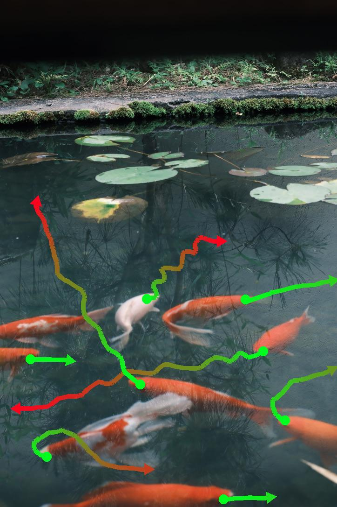
    </td>
    <td style="text-align: center; vertical-align: middle;">
      
    </td>
  </tr>

  <tr>
    <td style="text-align: center; vertical-align: middle;">
      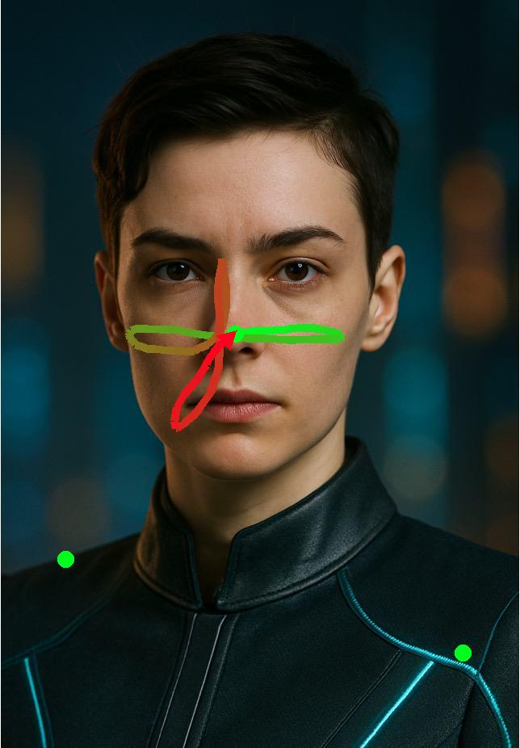
    </td>
    <td style="text-align: center; vertical-align: middle;">
      
    </td>
  </tr>

  <tr>
    <td style="text-align: center; vertical-align: middle;">
      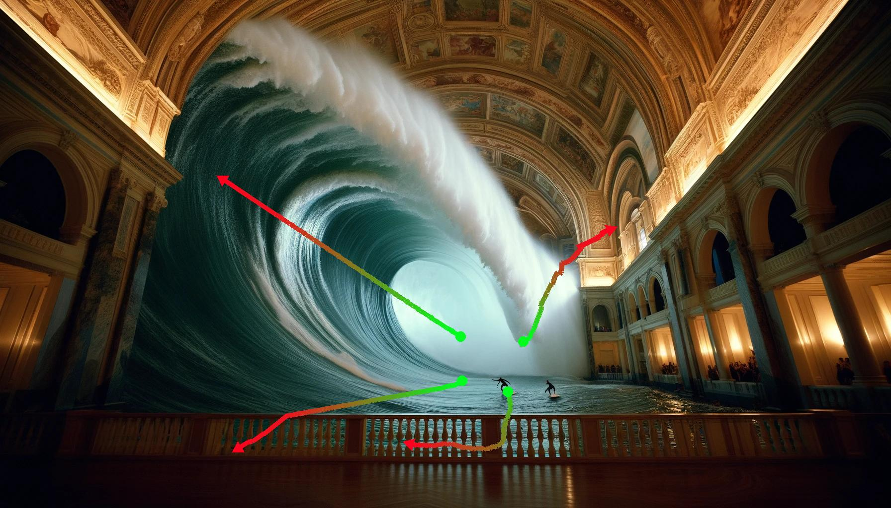
    </td>
    <td style="text-align: center; vertical-align: middle;">
      
    </td>
  </tr>

  </tr>
  <tr>
    <td style="text-align: center; vertical-align: middle;">
      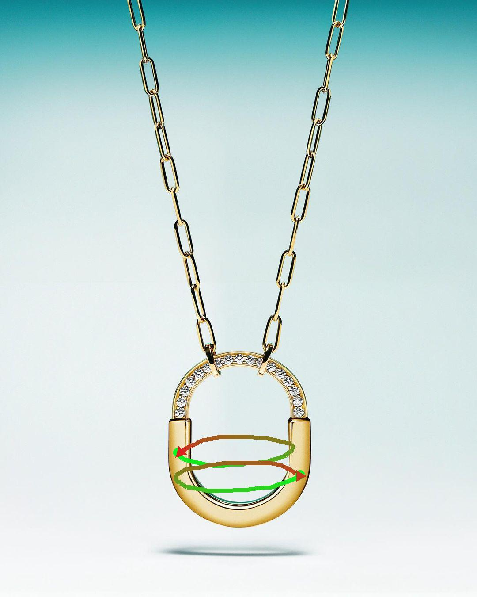
    </td>
    <td style="text-align: center; vertical-align: middle;">
      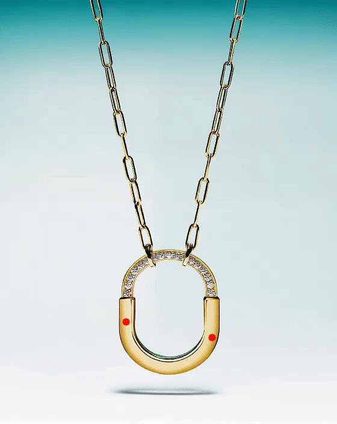
    </td>
  </tr>

  <tr>
    <td style="text-align: center; vertical-align: middle;">
      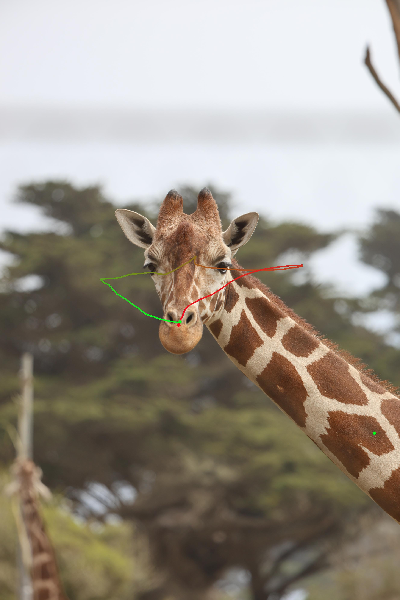
    </td>
    <td style="text-align: center; vertical-align: middle;">
      
    </td>
  </tr>

  <tr>
    <td style="text-align: center; vertical-align: middle;">
      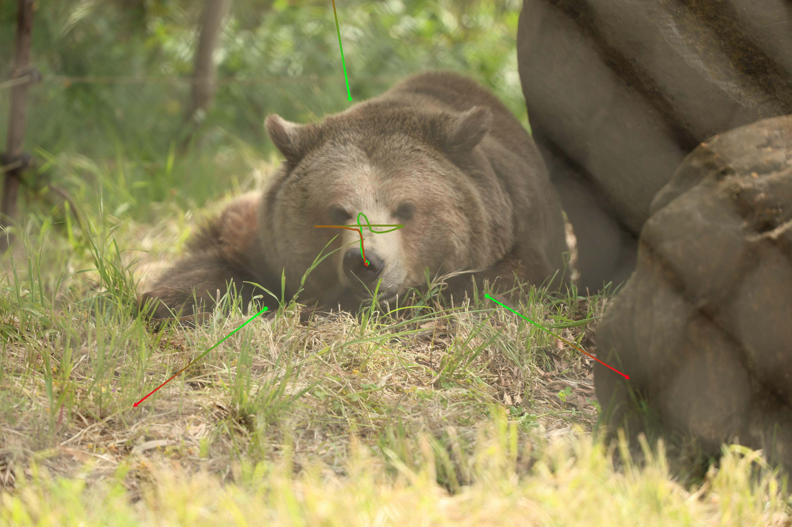
    </td>
    <td style="text-align: center; vertical-align: middle;">
      
    </td>
  </tr>
</table>


## Create You Own Trajectory

We provide an interactive tool that allow users to draw and edit trajectories on their images. 

1. First run:
```
cd tools/trajectory_editor
python3 app.py
```
then open this url [localhost:5000](http://localhost:5000/) in the browser. Note if you run the editor on the server, you need to replace `localhost` with the server's IP address.

2. Get the interface shown below, then click **Choose File** to open a local image.  
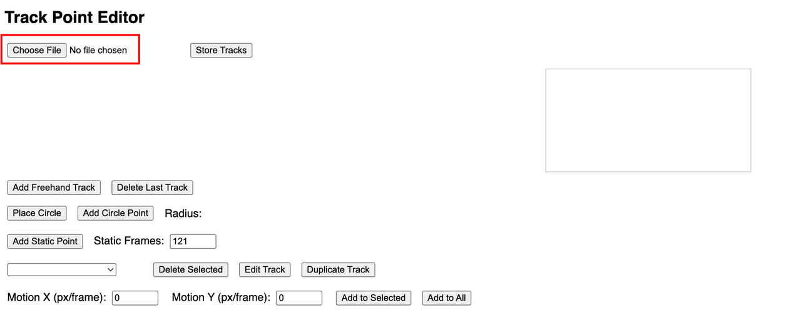

3. Available trajectory functions:  
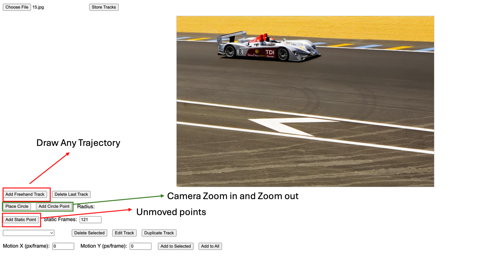

   a. **Free Trajectory**: Click and then drag with the mouse directly on the image.  
   b. **Circular (Camera Control)**:  
      - Place a circle on the image, then drag to set its size for frame 0.  
      - Place a few (3–4 recommended) track points on the circle.  
      - Drag the radius control to achieve zoom-in/zoom-out effects.  

   c. **Static Point**: A point that remains stationary over time.  

   *Note:* Pay attention to the progress bar in the box to control motion speed.  
   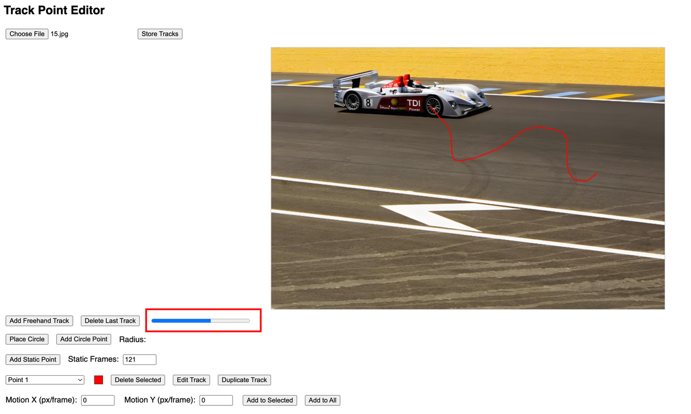

4. **Trajectory Editing**: Select a trajectory here, then delete, edit, or copy it. In edit mode, drag the trajectory directly on the image. The selected trajectory is highlighted by color.  


5. **Camera Pan Control**: Enter horizontal (X) or vertical (Y) speed (pixels per frame). Positive X moves right; negative X moves left. Positive Y moves down; negative Y moves up. Click **Add to Selected** to apply to the current trajectory, or **Add to All** to apply to all trajectories. The selected points will gain a constant pan motion on top of their existing movement.  
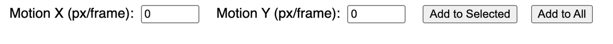

6. **Important:** After editing, click **Store Tracks** to save. Each image (not each trajectory) must be saved separately after drawing all trajectories.  
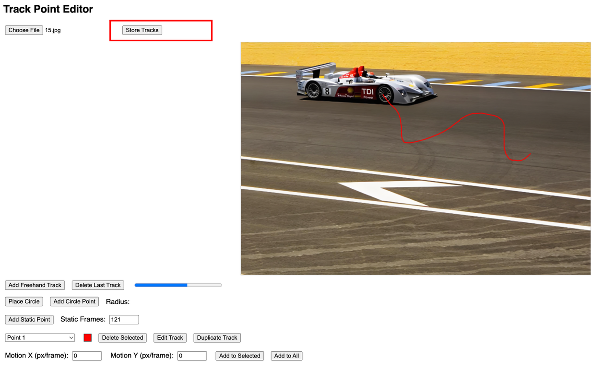

7. Once all edits are complete, locate the `videos_example` folder in the **Trajectory Editor**.


## Citation
Please cite our paper if you find our work useful:

